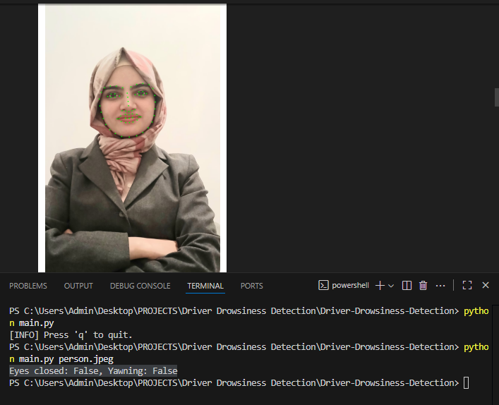
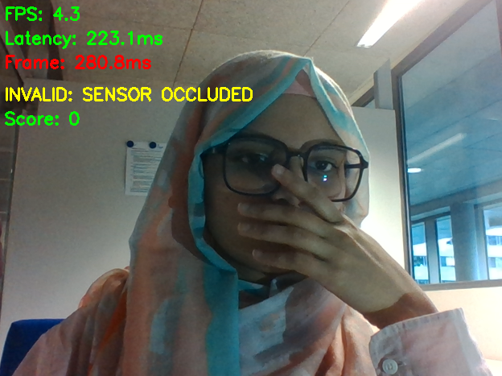

**Advanced Ambiguity-Aware Driver Drowsiness Detection**

This is a high-performance system to detect driver fatigue in real-time. It is designed  to be ambiguity-aware.

Unlike simple detectors, this system uses a machine learning model to tell the difference between true signs of fatigue (prolonged blinks, yawns) and false positives (talking, sneezing, or wiping the face).

🌟 ***Advanced Features***

- Drowsiness Scoring: Uses Eye Aspect Ratio (EAR) and Mouth Aspect Ratio (MAR) to build a score based on signs of fatigue.

- Ambiguity-Aware Anomaly Detection: A trained IsolationForest model (from scikit-learn) analyzes the [EAR, MAR] vector. It learns the pattern of "normal" driving and flags outliers like talking, sneezing, or yawning as an "ANOMALY".

- Occlusion Detection: Automatically detects when the face is not visible (e.g., hand wiping face, turned away) by checking for face_recognition landmarks. This sets an "INVALID: SENSOR OCCLUDED" status and prevents false alarms.

- Performance Monitoring: On-screen UI displays real-time FPS, processing Latency (ms), and Frame (ms) time to verify performance goals.

- Multi-State UI: Clearly displays the driver's current state:
STATUS: NOMINAL
STATUS: ANOMALY DETECTED
INVALID: SENSOR OCCLUDED
DROWSY ALERT!

🛠️ ***Tech Stack***
Python 3.11 
OpenCV: For video capture and UI display.
dlib (via face-recognition): For high-performance, CPU-based face and landmark detection.
Scikit-learn (sklearn): For the IsolationForest anomaly model and StandardScaler.
NumPy: For all numerical calculations.

📂 ***Project Structure***

Driver-Drowsiness-Detection/
│
├── train_anomaly_detector.py   # Script to train your anomaly model
├── main_detector.py            # The main real-time application
│
├── test_video.mp4              # Your "normal" driving video for training
├── dlib_anomaly_model.pkl      # The saved anomaly model
├── dlib_scaler.pkl             # The saved feature scaler
│
├── requirements.txt
├── README.md
└── assets/
    └── demo.png
    └── webcam results 1.png
    └── occlusion.png

📦 ***Installation*** (Recommended: Conda)
The dlib library can be difficult to install with pip. Using Conda is the most reliable method.
- Clone the repo:
git clone [https://github.com/rabya321/Driver-Drowsiness-Detection.git](https://github.com/rabya321/Driver-Drowsiness-Detection.git)
cd Driver-Drowsiness-Detection

- Create and activate a new Conda environment:
conda create -n drowsiness python=3.11
conda activate drowsiness

- Install face-recognition (with dlib) from Conda-Forge:
conda install -c conda-forge face-recognition

- Install the remaining packages:
pip install opencv-python scikit-learn

▶️ ***Usage*** (2-Step Process)
This system must be trained on your face before it can run.

- Step 1: Train Your Anomaly Model
You must first teach the model what your "normal" driving face looks like.

Record a "Normal" Video:

Use your webcam to record a 1-2 minute video of yourself.
This is critical: Act "normal" and "awake." Stare forward, check your mirrors, and blink normally.
DO NOT talk, yawn, sneeze, or hold your eyes closed. This will "poison" your training data.
Save the File: Save this video as test_video.mp4 in your project folder.
Run the Training Script: In your (drowsiness) terminal, run:

python train_anomaly_detector.py

This will process your video and create dlib_anomaly_model.pkl and dlib_scaler.pkl. You only need to do this once.

- Step 2: Run the Main Detector
Once the model is trained, you can run the main application:

python main_detector.py

The system will now launch and actively monitor your face, applying the drowsiness score and the anomaly detection logic in real-time.

##  Example Output

